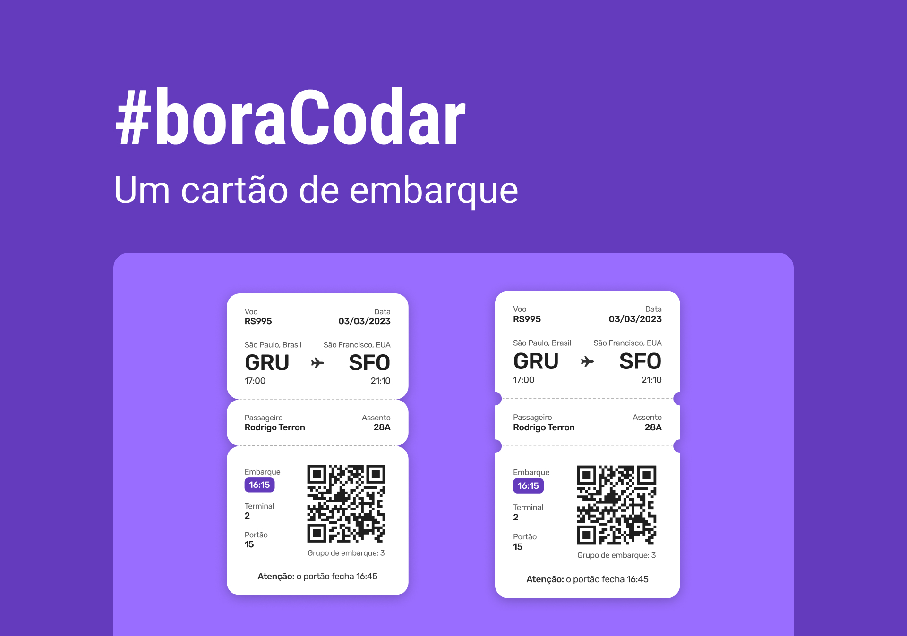
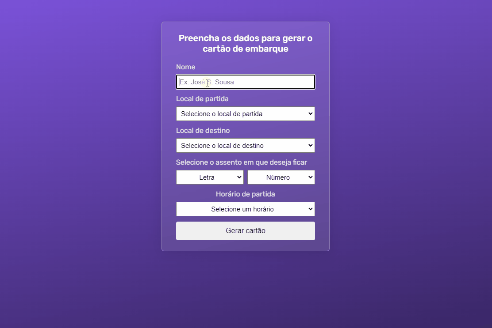
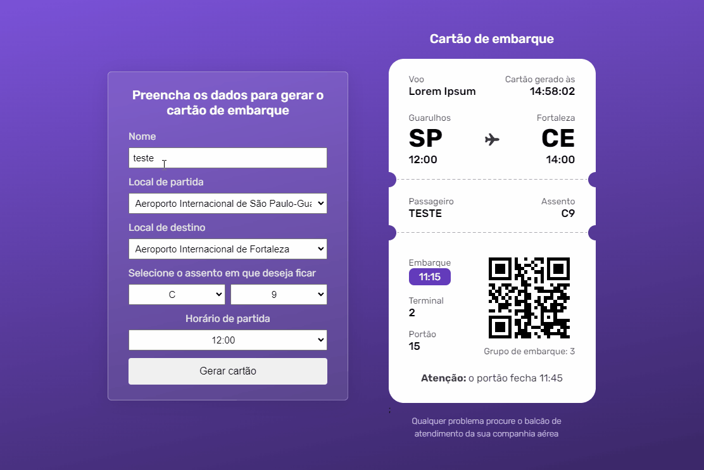

<h1 align="center"> Boarding Pass </h1>

<p align="center">
Desafio proposto pelo projeto <a href="https://boracodar.dev/">#boraCodar</a> da Rocketseat <br/>

<p align="center">
  <a href="#-tecnologias">Tecnologias</a>&nbsp;&nbsp;&nbsp;|&nbsp;&nbsp;&nbsp;
  <a href="#-projeto">Projeto</a>&nbsp;&nbsp;&nbsp;|&nbsp;&nbsp;&nbsp;
    <a href="#-instalação">Instalação</a>&nbsp;&nbsp;&nbsp;|&nbsp;&nbsp;&nbsp;
  <a href="#-layout">Layout</a>&nbsp;&nbsp;&nbsp;|&nbsp;&nbsp;&nbsp;
  <a href="#memo-licença">Licença</a>
</p>

<p align="center">
  
</p>

<br>

<p align="center">
  
</p>

## 🚀 Tecnologias

Esse projeto foi desenvolvido com as seguintes tecnologias:

- React
- Typescript
- Vite
- QRCode.react
- Css
- Git e Github
- Figma 

## 💻 Projeto

### O Boarding Pass é um componente de cartão de embarque.
### O cartão pode ser gerado através de um formulário para preencher as informações do passe de embarque.
O propósito desse projeto foi a aplicação prática de conceitos básicos da biblioteca ReactJs e de Typescript

<p align="center">
  
  
</p>


## 💾 Instalação

Siga os passos a seguir para executar o projeto na sua máquina

- Clone o repositório

```
git clone https://github.com/Hitalo-Lima/boarding-pass.git
```

- Instale as dependências do projeto

```
npm install
```

- Acesse o diretório do projeto

```
cd boarding-pass
```

- Rode o app

```
npm run dev
```

## 🔖 Layout

Você pode visualizar o layout do projeto através [DESSE LINK](https://www.figma.com/community/file/1205146101173113980). É necessário ter conta no [Figma](https://figma.com) para acessá-lo.

## 📝 Licença

Esse projeto está sob a licença MIT.
